# Wells_project_2
# Wellness API
# A full-stack wellness application. Rooted in fasting and exercising. Users are allowed to choose fasting and workout plans or create their own.
# unsolved problems: wanted to use public API but could not get it to work right. will # be Goal for 2nd edition

#Install instructions: express.js, node.js, mongodb
# .env, secrete, port 3000, mongoose
User stories: (`As a user ...`)

- user create a fasting plan
 - create a workout
 - create a model to use
- choose fasting plan 
 - choose workout plan 
 -return workout created plan
 -return fasting created plan
- view all plans 
 - query for a single plan - by ID?
- update plan
 - return updated document
- delele or remove plan 
- update plan - by ID?
 - default plan - by ID?

Schema: (model)
workout
 -trainning - String -required
 -exercise - String
 -reps - number
 -sets - number
 -rest - String
 -warmUp - String
 -frequency - String

Schema: (model)
- Plan
  - fastName - String
  - fastHrs -  String
  - dietOn -  String
  - dietOff -  String
  - frequency - String 
  
  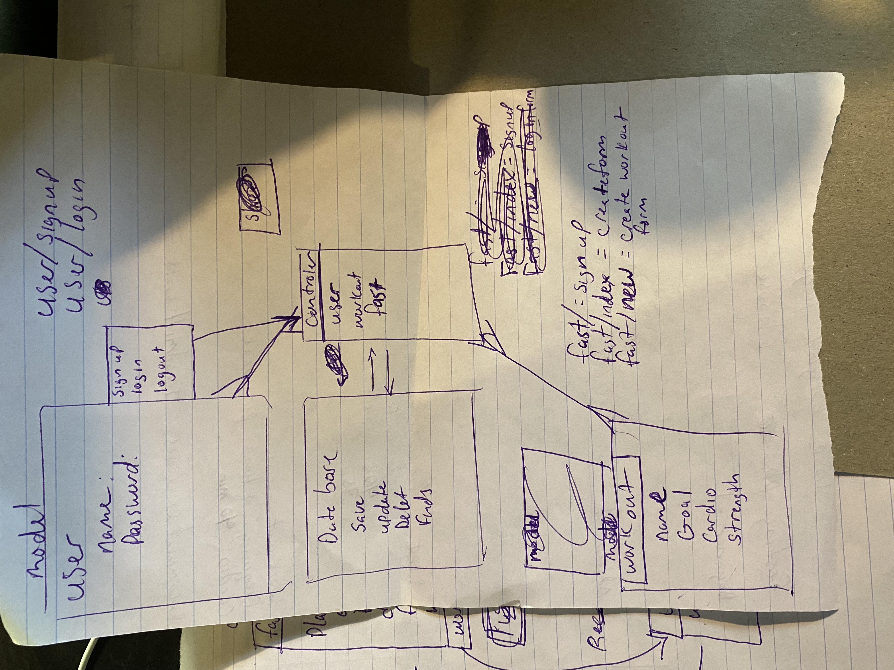
  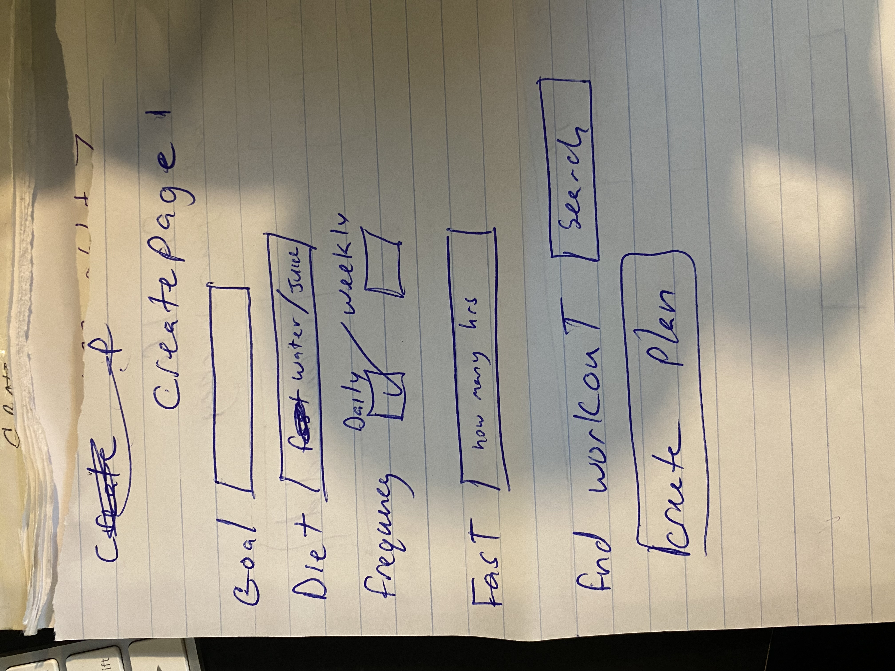
  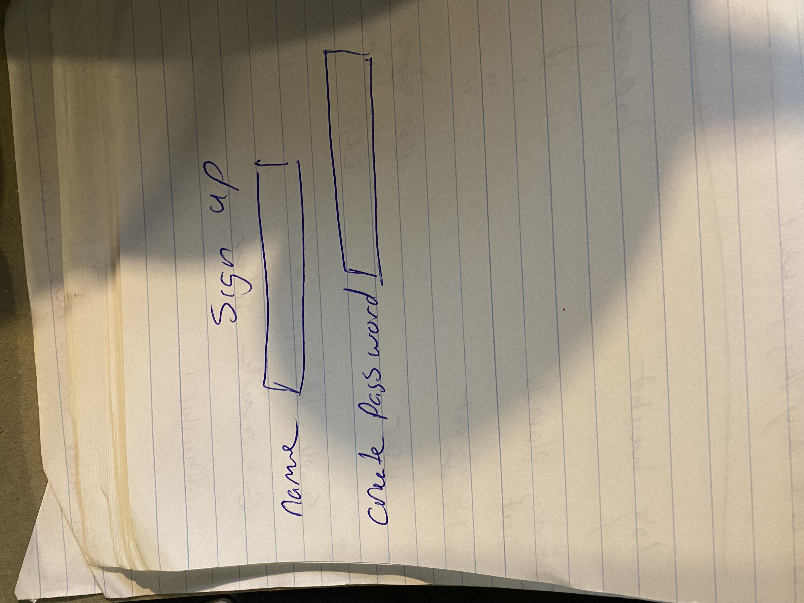
  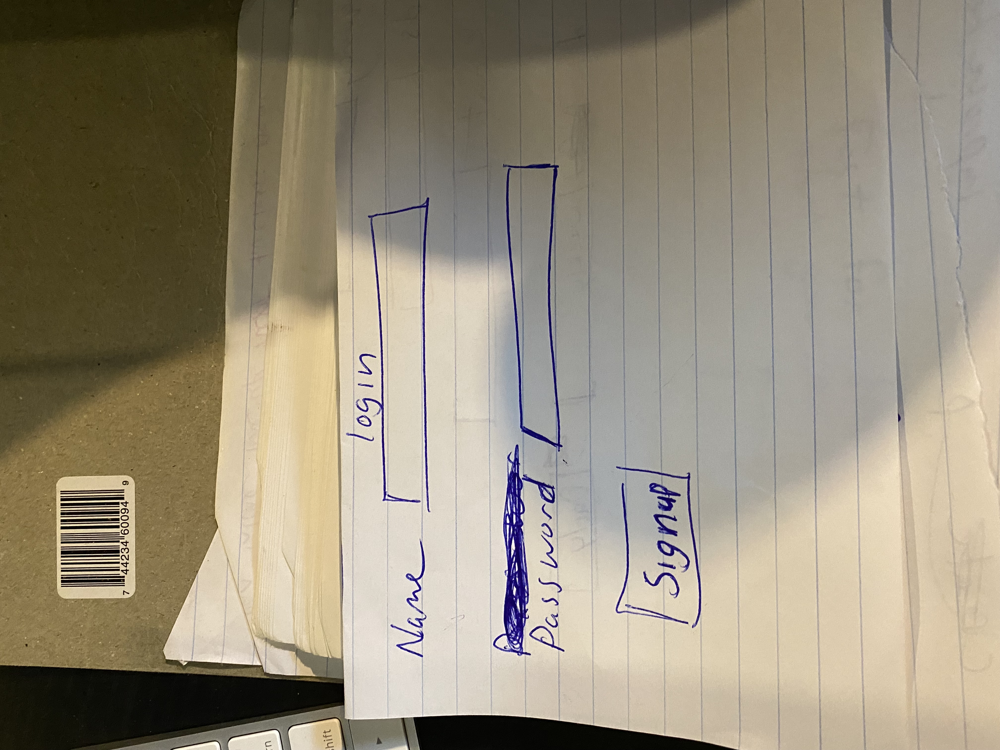
  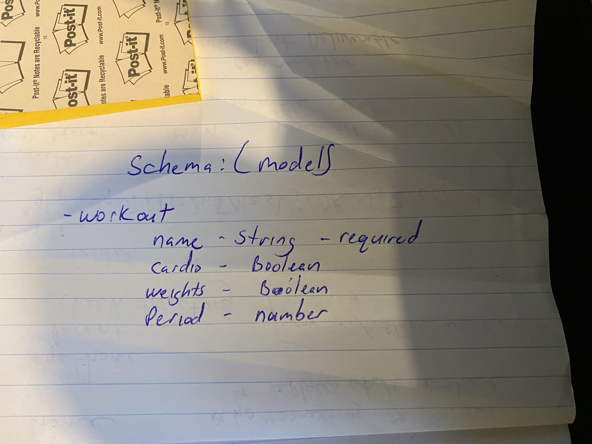
  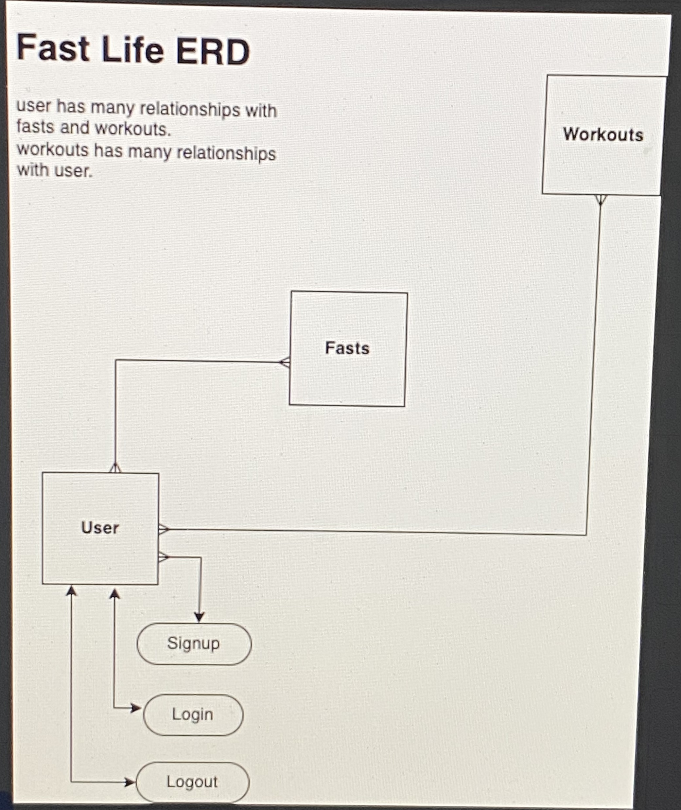
  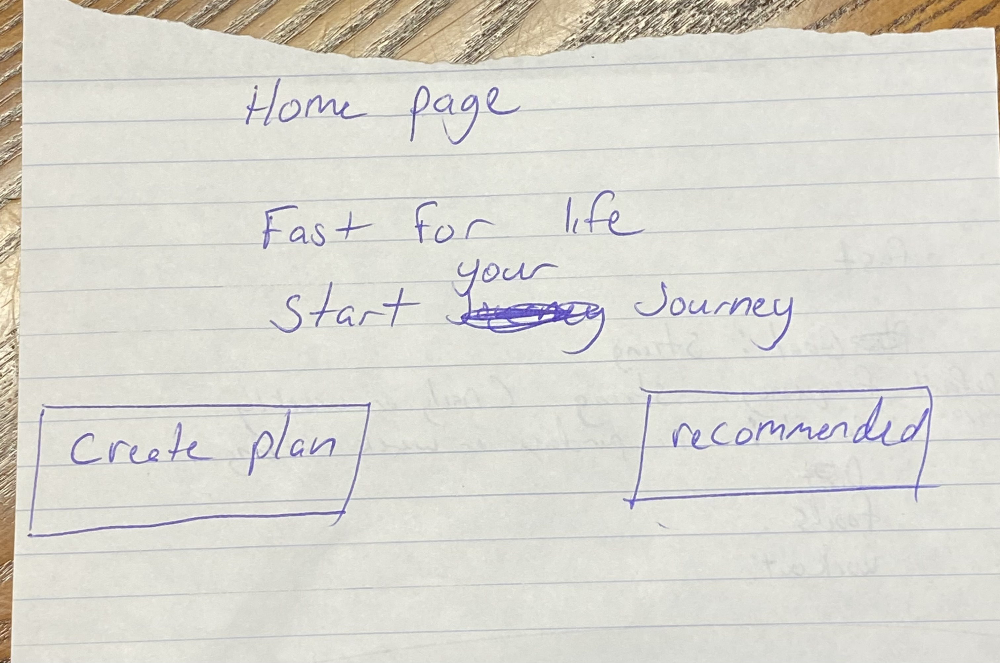
  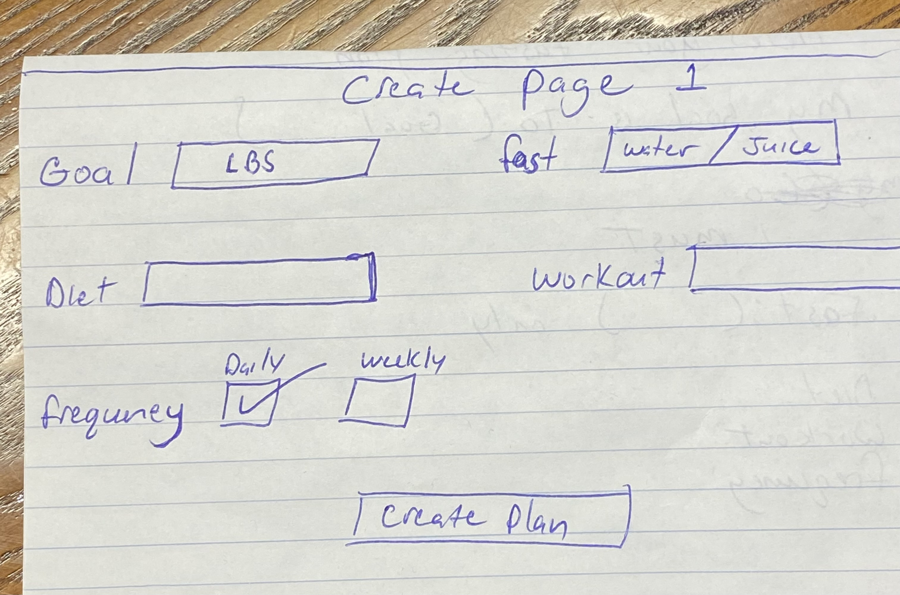
  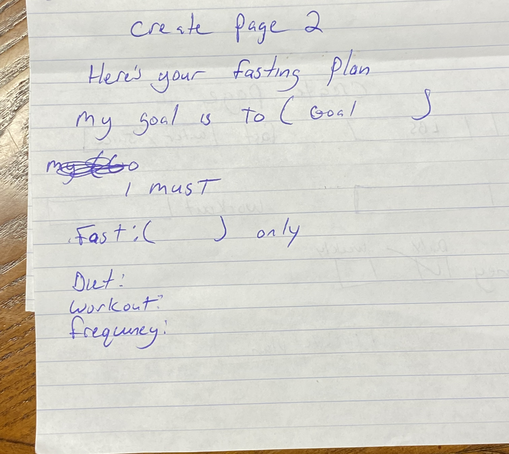
  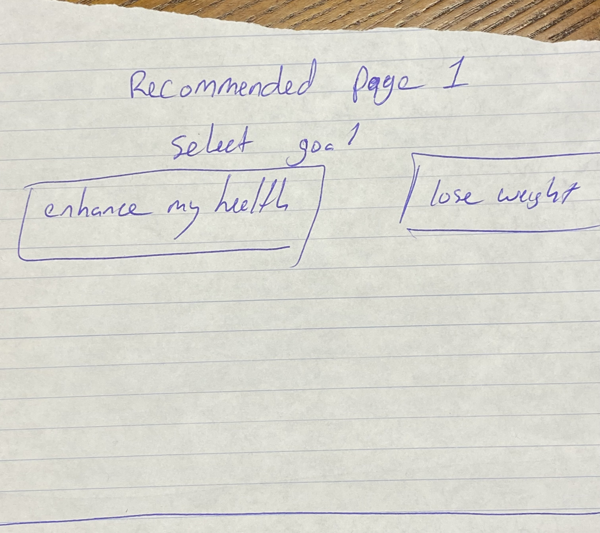
  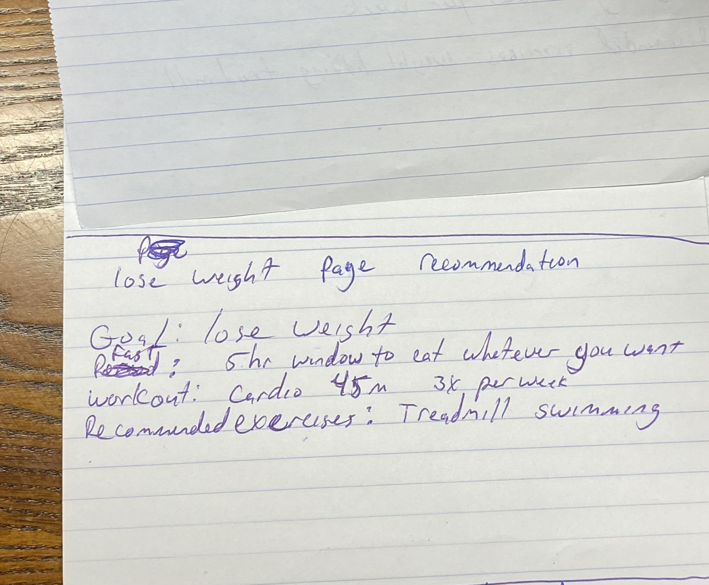
  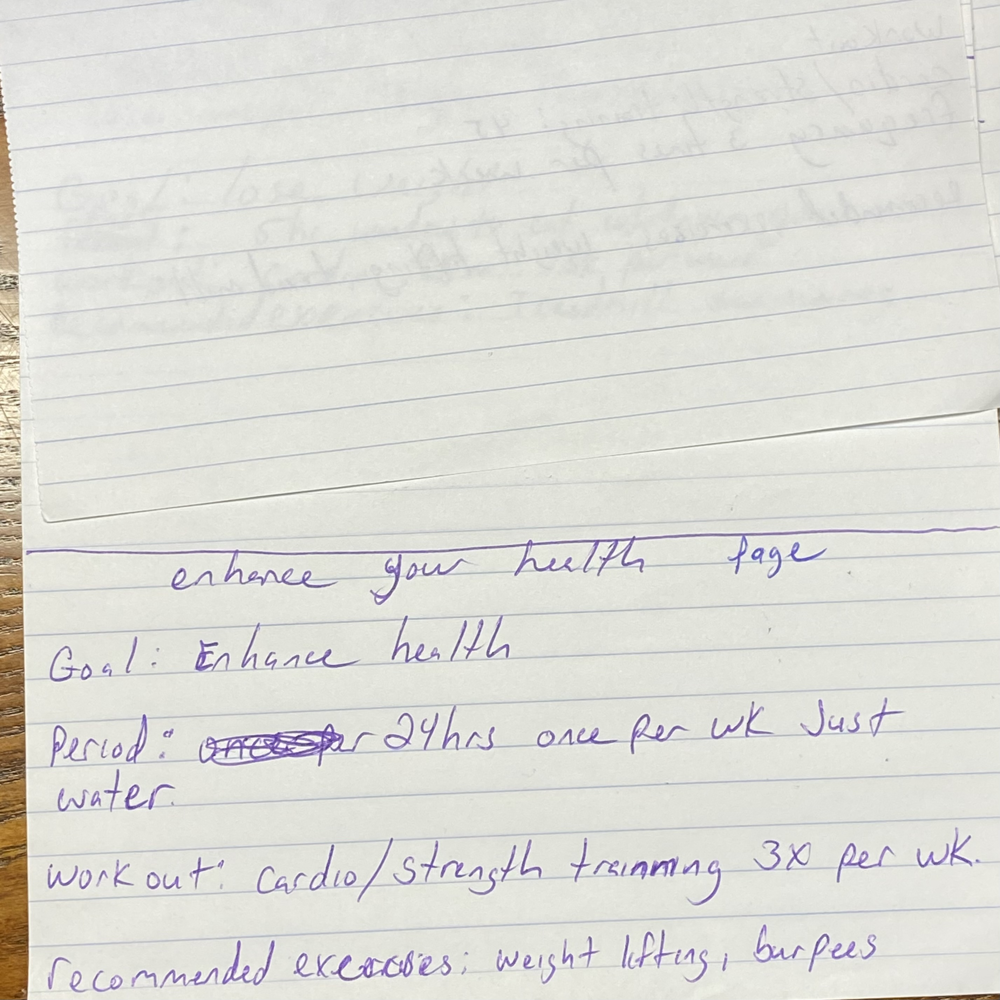
  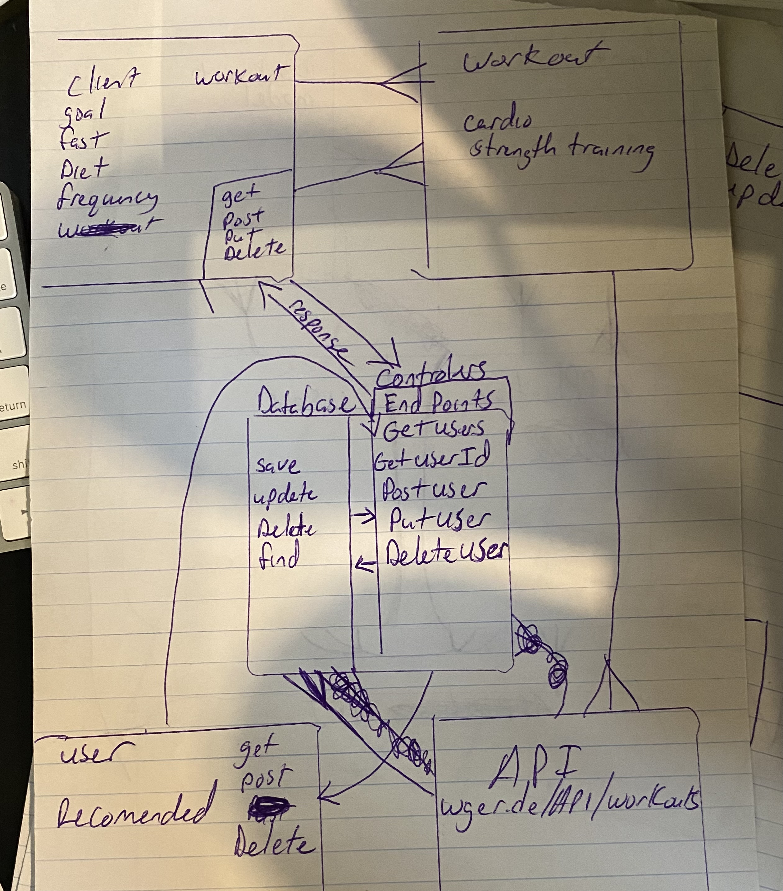
