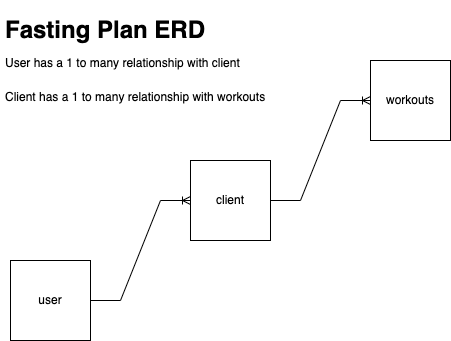

# Wells_project_2
# fasting API
# A full-stack wellness application. Rooted in fasting and exercising. Users are     allowed to choose fasting and workout plans or create their own.
# unsolved problems: wanted to use public API but could not get it to work right. will # be Goal for 2nd edition
User stories: (`As a user ...`)

- create a fasting plan
 - choose daily or weekly
 - choose workout, fasting period and goal
 - choose diet plan from api
 
 - new schema
-chose recomended plan 
 - create a model to use
 -return created plan
- view all plans 
 - query for a single plan - by ID?
- update plan
 - return updated document
- delele or remove plan 
- query for a single plan - by ID?
 - default value of some kind

Schema: (model)
workout
 -name -String -required
 -cardio -boolean
 -weights -boolean
 -period -number

Schema: (model)
- Plan
  - goal - String
  - fast -  String
  - diet -  String
  - workout -  String
  - frequency  String - default value of daily
  
  
  
  
  
  
  
  
  
  
  
  
  
  
